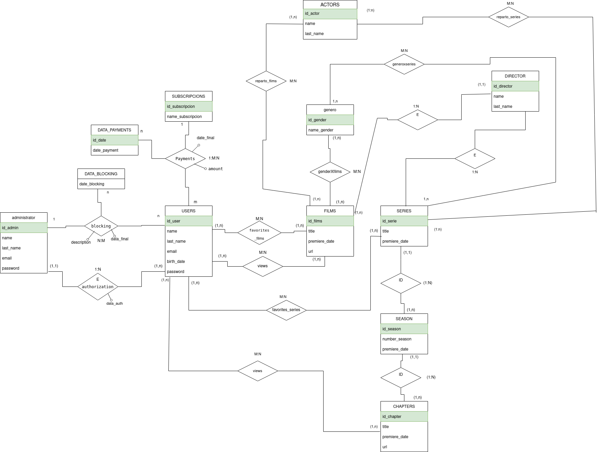

# base de datos petfix   

## diagrama de la base de datos de la app

    

## esquema logico relacional 

adminstrador(<ins>id_admin</ins>, name, last_name, email, password)    

users(<ins>id_user</ins>,name,last_name,email,birth_date,password)   

blockings(<ins>id_user,data_blocking</ins>,**id_admin**,description,data_final)      

authorization(<ins>id_admin,id_user</ins>,data_auth)     

subscripcions(<ins>id_subscripcion</ins>,name_subscripcion)     

payments(<ins>id_user,data_payment</ins>,**id_subscripcion**,name_subscripcion,amount)          

genders(<ins>id_gender</ins>,name_gender)   

generoxpelicula(<ins>id_gender,id_pelicula</ins>)          

generoxseries(<ins>id_gender,id_series</ins>)

films(<ins>id_films</ins>,title, premiere_date, url,descripcion,**id_director**)      

favorites_films(<ins>id_user,id_films</ins>)    

views_flims(<ins>id_user,id_films</ins>)     

series(<ins>id_serie</ins>,title,premier_date,descripcion,**id_director**)    

seasons(<ins>id_serie, id_season</int>, number_season, title , premiere_date)     

chapters(<ins>id_serie, id_season,id_chapter</ins>,title, premiere_date, url)     

views_series(<ins>id_user,id_serie,id_season,id_chapter</ins>)     

favorites_series(<ins>id_user,id_serie,id_season,id_chapter</ins>)       

director(<ins>id_director</ins>,name,last_name)    

actors(<ins>id_Actor</ins>,name,last_name)     

reparto_films(<ins>id_films,id_actor</ins>)     

reparto_series(<ins>id_serie,id_actor</ins>)     

## diagrama referencial   

relacion_referencial| clave foranea | relacion referida 
-|:-:|-
blockings | id_user | users  
blockings | id_admin | administrador  
authorization | id_admin | administrador
authorization | id_user | users 
payments | id_user | users
payments | id_subscripcion | subscripcion
generoxpelicula | id_gender | genders
generoxpelicula | id_user | users 
generoxseries | id_gender | genders
generoxseries | id_user | users 
films | id_director | director 
favorites_films | if_films | films
favorites_films |id_user | users
views_flims | id_user | users
views_flims | id_films | flims
series | id_director | director
seasons | id_serie | series 
chapters | id_serie | series
chapters | id_season | seasons 
views_series | id_user | users
views_series | id_serie | serie
views_series | id_season | season
view_series | id_chapter | chapters
favorites_series | id_user | users 
favorites_series |id_serie | series
favorites_series | id_season | season
favorites_series | id_chapter | chapters 
reparto_films | id_films | films 
reparto_films | id_actor | actor
reparto_series | id_serie | series 
reparto_series |id_actor | actor
