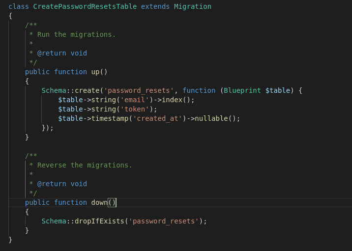
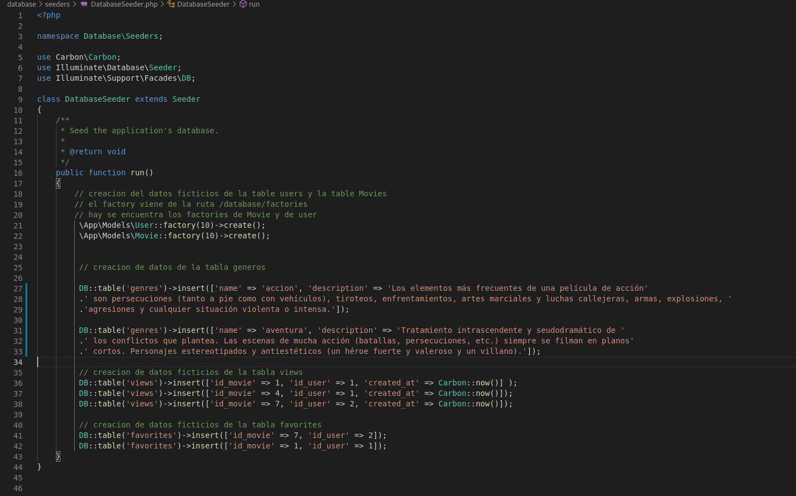
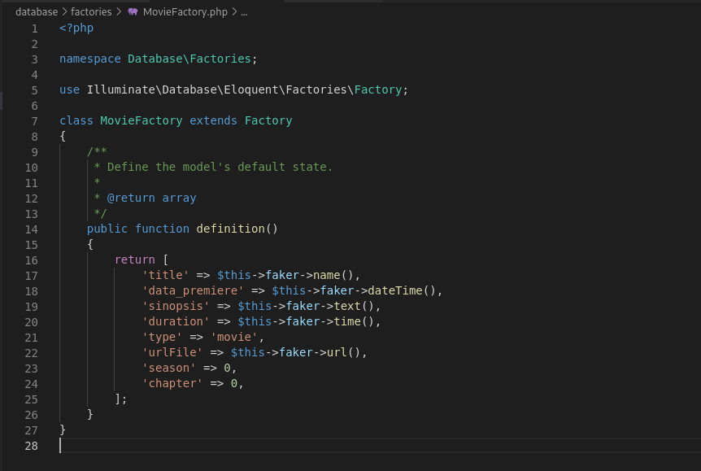

## documentacion de crear bases de datos en laravel 8

##### 1) generar el fichero de migracion (donde estara la estructura de la bd)

en laravel hay comandos que te crean el fichero de migracion con el cual se crean  las tablas     
los comandos que pudes usar son:

`php artisan make:migration <nombre de la tabla>`    

 <b>nota: el nombre tiene que estar en plurar ya que internamente laravel cuando utilice el modelo para recoger informacion de las tablas el buscara la informacion agregando una s al final del mismo nobre del modelo </b>    

 otro comando que sirve y te genera de una ves el modelo y la migracion es:
 `php artisan make:model <nombre del modelo> -m` 
 en este caso el nombre se coloca en singular ya que se esta creando es el modelo y laravel cuando cree el fichero de migracion ya lo crea con una s al final 

<b>nota 2: es importante crear las migraciones en orden de creacion como en una base de datos</b>    

   
 ##### 2) contenido de las migraciones   
 
 los ficheros de las migraciones se encuentran en la ruta `/database/migrations` en esos ficheros se creara la estrucutura de la BD 

dentro de los ficheros se encontrara las clases que generan la BD, las clases tendran 2 funciones `up y down`.

dentro de la funcion`up ` es donde crearemos las estructura de la BD un ejemplo es este:

   

##### 3)  crear la tablas en la base de datos 

con el comando `php artisan migrate` ya te genera la estructura de la base de datos 

##### 4) borrar la base de dato (borra el contenido y las tablas)

con el comando `php artisan db:wipe`

mas informacion sbre migraciones: [pag laravel](https://laravel.com/docs/8.x/migrations)    

##### 5) generar datos dummy

para generar los datos dummy tenemos los seeders 

el la ruta `/database/seeders` se encuentra los ficheros donde puedes generar contenido dummy 

aqui un ejemplo del fichero :
 

nota: Carbon:now() es una clase que maneja fechas

los factory sirven para crear mas de 1 datos de insecion en la base de datos 
para crear un factory 
 con el comando : `php artisan make:factory MovieFactory` el te crea el fichero factory en la ruta: `/database/factories` el te crea una clase con una funcion llamada definition() en esa funcion colocaras los datos ramdon para generar los insert en la BD el documento seria asi:

 

ya laravel tiene unas funcione que genera nombres, correos, direcciones, etc aleatorias para poder mirar esas funciones mirar en el fichero : 
`vendor/fakerphp/faker/src/Faker/Generator.php`

para mas informacion de la generacion de datos dummy tienes este link :  [pag laravel](https://laravel.com/docs/8.x/database-testing) 